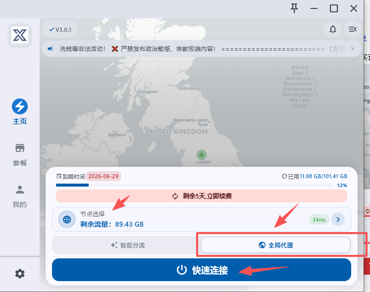
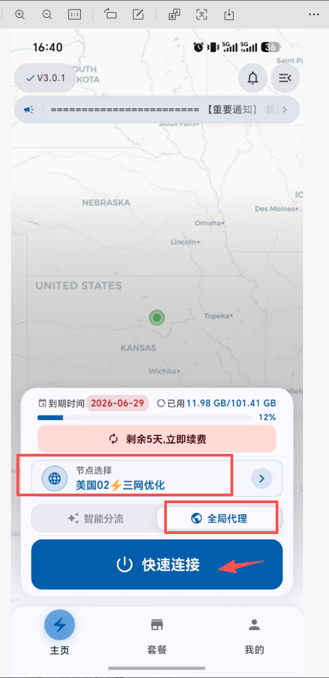
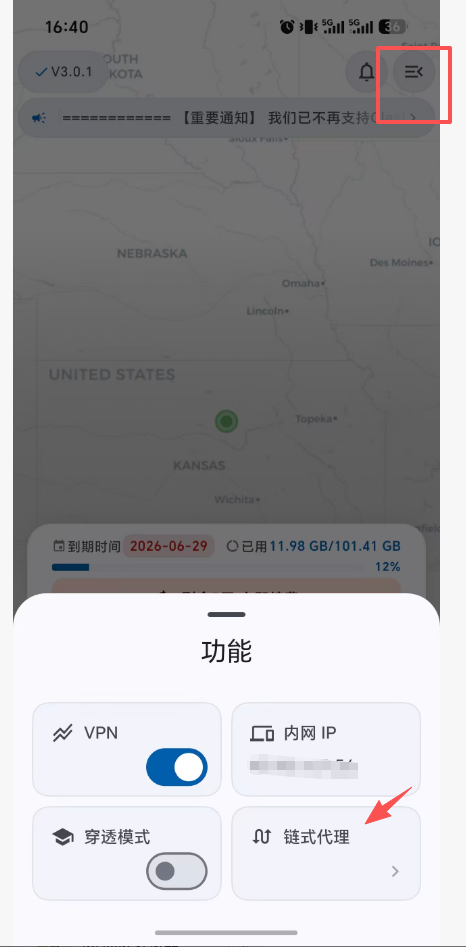
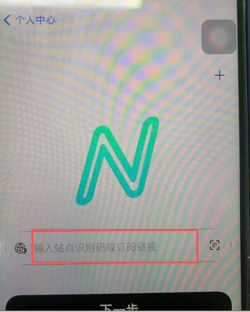
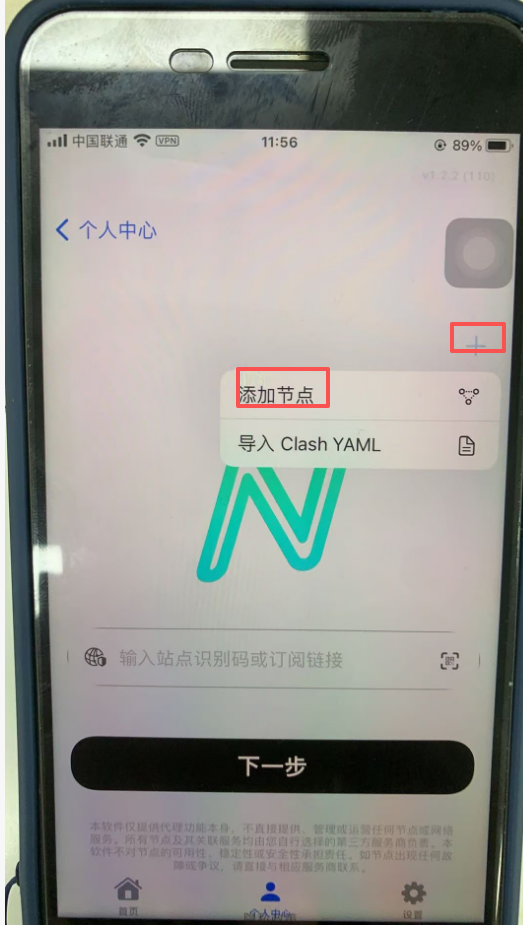
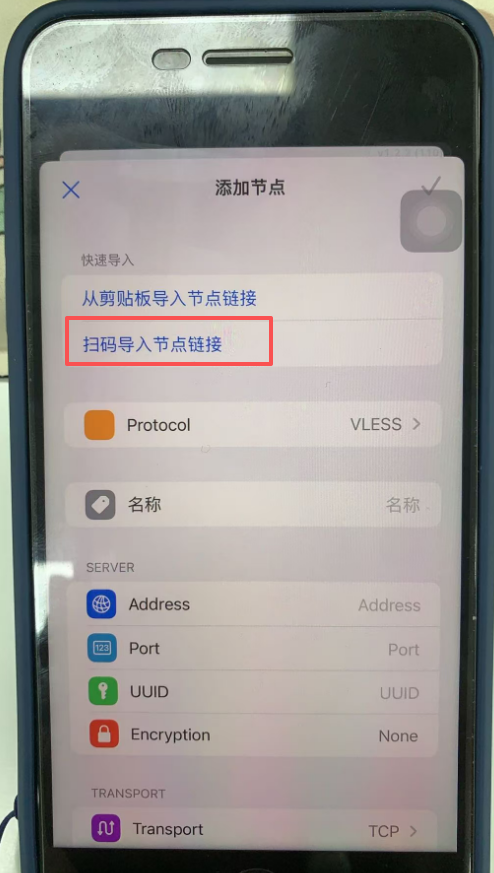
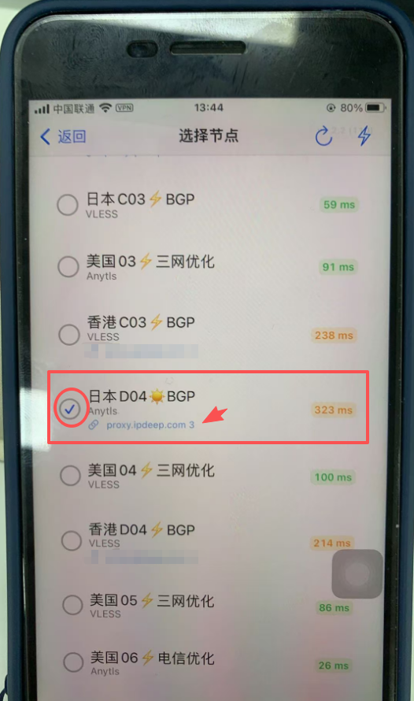

# 海外代理IP使用前的网络环境配置指南

官网地址：https://xxyun.ai

操作文档：https://cloud.v4ppone.de/knowledge

注册用户名：要求邮箱注册，购买套餐

## 电脑端

1.下载并安装客户端，打开后显示登录界面。

2.输入 xxyun 账号与密码 直接登录。

3.登录后点击 连接 即可使用服务。

4.节点选择自己要的国家。

5.打开全局代理和快速连接按钮。

## 安卓端

1.下载并安装客户端，打开后显示登录界面。

2.输入 xxyun 账号与密码 直接登录。

3.登录后点击 连接 即可使用服务。

4.输入 xxyun 账号与密码 直接登录。

5.登录后点击 连接 即可使用服务。

6.右上角点开，添加链式代理，输入你[购买的IP信息](https://user.ipdeep.cn/?extendid=5fb9MGNmMDI1OTI0MzA0MjE2MjYwNjc4)，打开快速连接按钮。

## 苹果端

1.iOS端需使用美区 Apple ID 登录 App Store 搜索Nextin（星拓）下载

2.安装好客户端后，开客户端，在服务商/订阅框内输入字母：xxyun

3.随后依次输入您在本站注册的账号和密码。

4.点击登录，即可成功连接并使用。

5.添加链式代理步骤：个人中心，添加服务，右上角+，添加节点，扫码导入节点连接，回到首页，点击选择节点按钮，会显示新添加的 proxy.ipdeep.com 的IP，证明 新IP 添加成功。

6.个人中心，选择延迟小的国家，例如新加坡长按，会出现设置链式代理出口，点开后勾选添加的 新IP 例如 procy.ipdeep.com 这个就可以。

